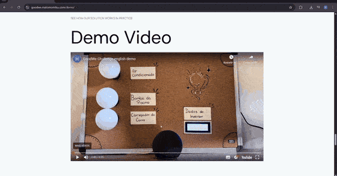
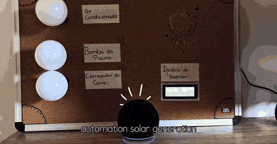
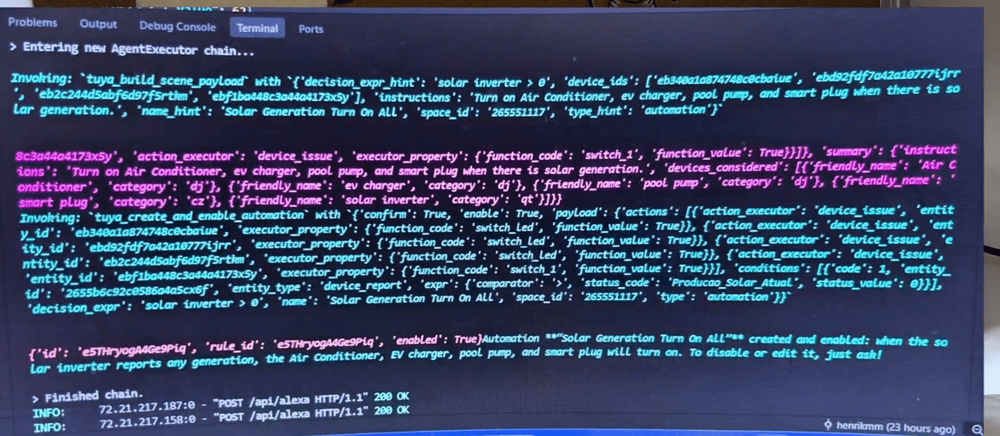
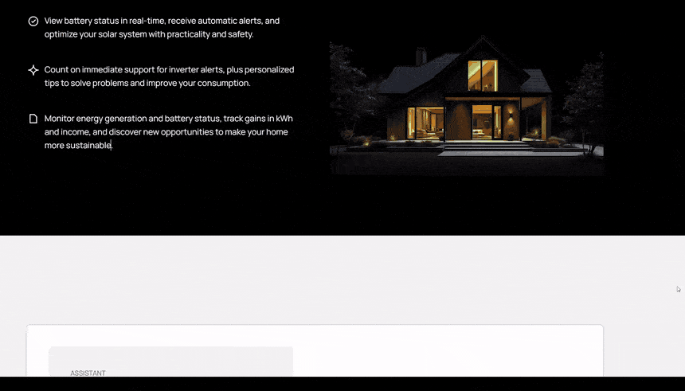
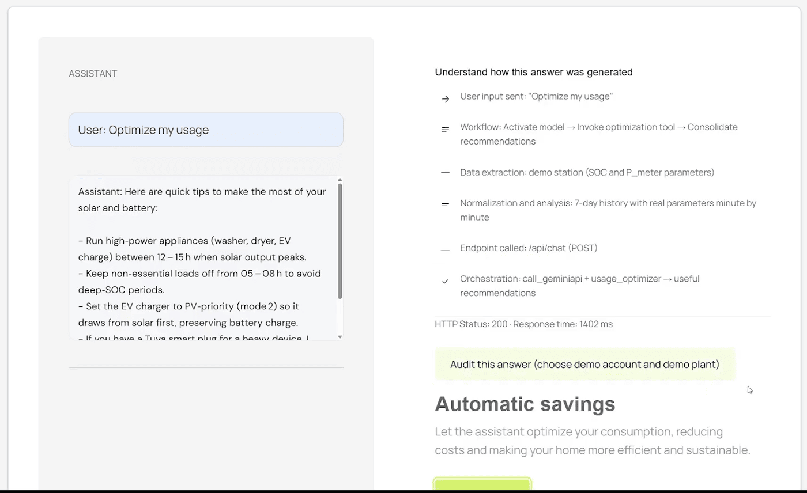
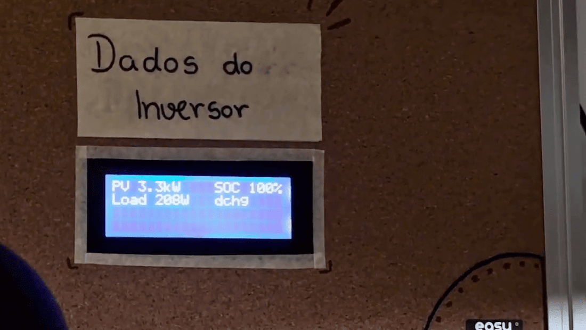
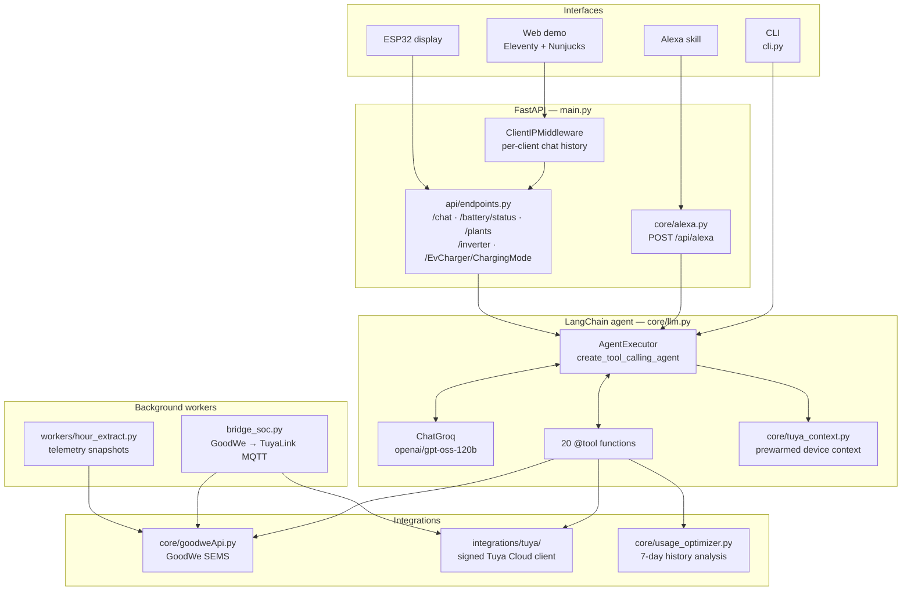
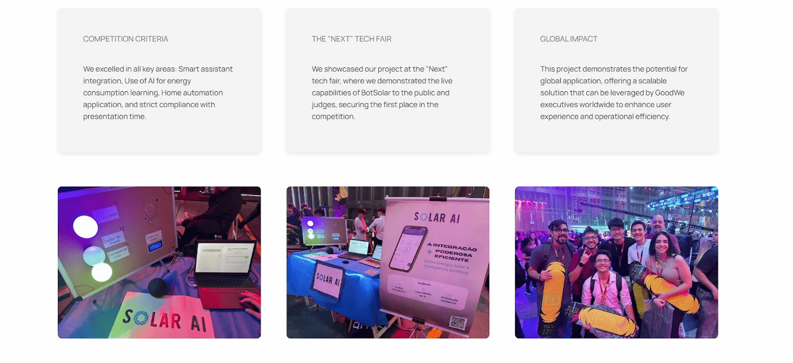

<div align="center">

# BotSolar — GoodWe × Tuya AI Assistant
### `Groq + LangChain + English` branch

**Talk to your solar inverter. It reads your house, writes the automation, and turns the lights on.**

A LangChain tool-calling agent, running on Groq, that connects a GoodWe solar inverter to a Tuya/SmartLife home — exposed through a REST API, a web demo, a CLI, and an Alexa skill.

🥇 **1st place — GoodWe × FIAP Challenge**, presented at the *Next* tech fair.

[**▶ Watch the 5-minute demo**](https://www.youtube.com/watch?v=kRdJpBNVDF8) · [Architecture](#architecture) · [What this branch changes](#what-this-branch-changes) · [Quick start](#quick-start)


</div>

> **You are on a rewrite branch.** This branch replaces the Gemini function-calling orchestrator on [`main`](https://github.com/Matomomitsu/ChallengeDemo/tree/main) with a LangChain `AgentExecutor` driven by a Groq-hosted model, and moves the system prompt to English-first. It was created without a shared ancestor with `main`, so the two cannot be merged or fast-forwarded — read them side by side. See [What this branch changes](#what-this-branch-changes).

---

## See it work

The demo below was recorded against **this branch** — the terminal trace is LangChain's `AgentExecutor`.

### Voice → agent → real hardware

Ask Alexa for something in plain language. The agent inspects the actual devices in the Tuya space, builds a scene payload, creates and enables the automation, and the room responds.

<table>
<tr>
<td width="50%">



*"Solar assistant, create an automation to turn on all my devices when there's solar generation."*

</td>
<td width="50%">



*Air conditioner, EV charger, pool pump and smart plug fire together once the inverter reports generation.*

</td>
</tr>
</table>

### What that voice command actually did

One sentence became a tool-calling chain: build the scene payload from the devices it found, then create and enable the rule against the Tuya Cloud API — with an ESP32 on the wall reading live inverter telemetry the whole time.



> `Entering new AgentExecutor chain...` → `tuya_build_scene_payload` resolves friendly names into device IDs and datapoint codes → `tuya_create_and_enable_automation` commits the rule → `Finished chain.` → `POST /api/alexa 200 OK`.

### The web demo

Every answer ships with its own trace: what the model was asked, which tools it invoked, which endpoint was hit, and how long it took.





### Hardware in the loop



An ESP32 polls `GET /api/inverter` every few seconds and renders PV power, house load, battery SOC and charge state on an I²C LCD. Setup guide: [`docs/esp32_display_demo.md`](docs/esp32_display_demo.md).

---

## What this branch changes

|  | [`main`](https://github.com/Matomomitsu/ChallengeDemo/tree/main) | **this branch** |
|---|---|---|
| Tools exposed | 19 | 20 — adds `get_today_date` |
| Orchestrator module | `core/gemini.py` (~1100 lines) | `core/llm.py` (~375 lines) |
| Model | Google Gemini 2.5 Flash | `openai/gpt-oss-120b` on Groq |
| Tool binding | `google-genai` `types.FunctionDeclaration`, hand-written dispatch table | `@tool`-decorated Python functions, schemas inferred from type hints |
| Agent loop | Custom loop with retry/backoff on 408/409/425/429/5xx | LangChain `create_tool_calling_agent` + `AgentExecutor` |
| Prompting | Ad-hoc message assembly | `ChatPromptTemplate` with `chat_history` and `agent_scratchpad` placeholders |
| Conversation memory | Single global chat instance | Per-client history keyed by IP (`ClientIPMiddleware` in `main.py`) |
| Tuya context | Inline in `core/gemini.py` | Extracted to `core/tuya_context.py`, prewarmed on first request |
| System prompt | Portuguese-leaning defaults and phrasing | English-first, with an explicit language-mirroring rule and latency guidance |
| Extra deps | `google-genai` | `langchain`, `langchain-groq`, `langchain-community` |

The rewrite collapses the hand-rolled function-calling plumbing — declaration objects, argument coercion, dispatch, retry — into LangChain primitives, which is where most of those ~700 lines went. Tool bodies themselves are essentially unchanged, so behaviour is comparable; the difference is in how much orchestration code the repo has to own.

The agent itself is about thirty lines:

```python
llm = ChatGroq(temperature=0, model_name="openai/gpt-oss-120b", groq_api_key=GROQ_API_KEY)

prompt = ChatPromptTemplate.from_messages([
    ("system", get_system_prompt()),
    ("placeholder", "{chat_history}"),
    ("human", "{input}"),
    ("placeholder", "{agent_scratchpad}"),
])

agent = create_tool_calling_agent(llm, ALL_TOOLS, prompt)
agent_executor = AgentExecutor(agent=agent, tools=ALL_TOOLS, verbose=True)
```

### Known rough edges on this branch

- `main.py` still prints a startup check for `GEMINI_API_KEY`; the pipeline actually reads `GROQ_API_KEY`. Cosmetic, but confusing on first run.
- `call_llm` returns an empty `functions_preview` — intermediate steps are not yet extracted from the agent result, so the web demo's trace panel has less to show than on `main`.
- `worker_extract.dockerfile` still copies `./extract_worker`, but the module now lives at `workers/hour_extract.py`.

---

## What it does

**Solar monitoring (GoodWe SEMS)**

- Real-time battery SOC and inverter telemetry for one or many plants
- Alarms by date range, with translated reasons and suggested fixes
- Generation and income by day, month, and year
- EV charger status and charge-mode switching (e.g. PV-priority)
- 7-day history analysis that turns raw minute-by-minute data into usage advice

**Home automation (Tuya Cloud / SmartLife)**

- Discovers devices in a Tuya space, inspects their datapoints and current shadow state
- Proposes automations from five built-in heuristics: *Battery Protect*, *Battery Surplus*, *Solar Surplus*, *Solar Deficit*, *Night Guard*
- Builds, creates, updates, deletes, enables/disables and triggers scenes — every mutation behind a confirmation gate
- Publishes GoodWe telemetry back into Tuya over TuyaLink MQTT, so inverter values become usable triggers for any SmartLife scene

**Interfaces**

- FastAPI REST API with OpenAPI docs
- Static web demo (Eleventy + Nunjucks) served at `/demo`
- Interactive CLI, plus a dedicated Typer CLI for Tuya operations
- Alexa custom skill webhook

---

## Architecture



**Request path, end to end:** user utterance → FastAPI → `call_llm` → Tuya context augmentation → `AgentExecutor` → tool selection → GoodWe SEMS and/or Tuya Cloud → structured tool result → natural-language answer.

### Tool surface

| Domain | Tools |
|---|---|
| Time | `get_today_date` |
| Plants | `list_plants`, `get_powerstation_battery_status` |
| Alarms | `get_alarms_by_range`, `get_warning_detail` |
| Generation & income | `get_powerstation_power_and_income_by_day` / `_by_month` / `_by_year` |
| EV charger | `get_ev_charger_status`, `change_ev_charger_status` |
| Optimization | `optimize_usage` |
| Tuya discovery | `tuya_describe_space`, `tuya_inspect_device` |
| Tuya automation | `tuya_propose_automation`, `tuya_build_scene_payload`, `tuya_create_and_enable_automation`, `tuya_update_automation`, `tuya_delete_automations`, `tuya_set_automation_state`, `tuya_trigger_scene` |

Every Tuya mutation takes a `confirm` flag, so the model has to explicitly commit to a change rather than drifting into one.

---

## Quick start

**Requirements:** Python 3.9+ · Node 22+ (only for rebuilding the web demo) · a Groq API key · GoodWe SEMS credentials · Tuya Cloud keys (optional, for automation features)

```bash
pip install -r requirements.txt
cp .env.example .env    # then fill it in — see Configuration below
python main.py
```

- API — `http://localhost:8001`
- OpenAPI docs — `http://localhost:8001/docs`
- Web demo — `http://localhost:8001/demo`

**Interactive CLI**

```bash
python cli.py
```

**Tuya automation CLI** — device inspection, heuristic proposals, scene CRUD:

```bash
python -m integrations.tuya.cli --help
```

Full walkthrough in [`docs/tuya_automation.md`](docs/tuya_automation.md).

**GoodWe → Tuya SOC bridge** — publishes inverter telemetry into Tuya so it can drive SmartLife scenes:

```bash
python -m integrations.tuya.bridge_soc
```

Runs in dry-run (prints the payload) when Tuya credentials are absent. Details in [`docs/tuya_soc_bridge.md`](docs/tuya_soc_bridge.md).

**Frontend**

The Eleventy project lives in `frontend/` and builds to `frontend/public`, which FastAPI serves directly at `/demo`.

```bash
cd frontend
npm install
npm run build
```

**Docker**

```bash
docker build -f api.dockerfile -t botsolar-api .                    # API + built frontend
docker build -f tuya_soc_bridge_worker.dockerfile -t botsolar-bridge .
```

**Tests**

```bash
pytest tests/
```

---

## Configuration

Copy `.env.example` to `.env` and fill in what you need. Only the GoodWe and Groq keys are required; everything Tuya is optional until you want automation.

```ini
# --- GoodWe ---
GOODWE_ACCOUNT=
GOODWE_PASSWORD=
GROQ_API_KEY=
DEFAULT_POWERSTATION_NAME=        # resolved by name if no ID is given
DEFAULT_POWERSTATION_ID=          # or pin the plant explicitly
GOODWE_POWERSTATION_ID=

# --- Tuya / SmartLife Cloud (optional) ---
TUYA_CLIENT_ID=
TUYA_CLIENT_SECRET=
TUYA_PROJECT_CODE=
TUYA_API_BASE_URL=https://openapi.tuyaus.com
TUYA_SPACE_ID=
ALEXA_TUYA_SKILL_IDS=

# --- TuyaLink MQTT bridge (optional) ---
TUYA_DEVICE_ID=
TUYA_DEVICE_SECRET=
TUYA_MQTT_HOST=m1.tuyaus.com
TUYA_MQTT_PORT=8883
TUYA_HEARTBEAT_INTERVAL=10        # fast heartbeat, seconds
TUYA_DATA_POLL_INTERVAL=300       # GoodWe poll interval, seconds
TUYA_SOC_LOG_LEVEL=INFO
```

---

## API reference

Routes are mounted under `/api`.

| Method | Path | Purpose |
|---|---|---|
| `POST` | `/api/chat` | Natural-language interface — the main entry point |
| `POST` | `/api/alexa` | Alexa custom skill webhook |
| `POST` | `/api/google/webhook` | Google Assistant webhook |
| `GET` | `/api/battery/status` | Battery SOC for the default plant |
| `GET` | `/api/plants` | List available plants |
| `GET` | `/api/inverter` | Latest inverter telemetry snapshot (what the ESP32 reads) |
| `GET` | `/api/EvCharger/ChargingMode` | Current EV charger mode |
| `DELETE` | `/api/delete/scenes` | Bulk-delete scenes in the configured space |
| `GET` | `/api/health` | Health check |
| `GET` | `/api/` | API overview |

---

## Project layout

```
├── main.py                          FastAPI app, ClientIPMiddleware, static mount for /demo
├── cli.py                           Interactive chat CLI
├── system_prompt.txt                English-first agent system prompt
├── core/
│   ├── llm.py                       LangChain agent — ChatGroq, @tool defs, AgentExecutor
│   ├── tuya_context.py              Tuya device context manager + cache prewarming
│   ├── goodweApi.py                 GoodWe SEMS client — token, plants, SOC, alarms, income
│   ├── tuya_scene_builder.py        Natural language → Tuya scene payload
│   ├── usage_optimizer.py           7-day history analysis → usage recommendations
│   ├── sems_history.py              History fetch and parsing
│   ├── alexa.py                     Alexa skill webhook
│   ├── cacheServices.py             Response caching
│   └── sqlite.py                    Local persistence
├── api/endpoints.py                 REST routes and Pydantic models
├── integrations/tuya/
│   ├── client.py                    Signed HTTP client — token refresh, rate-limit backoff
│   ├── models.py                    Pydantic models for devices, scenes, conditions, actions
│   ├── mapping.py                   Logical name → datapoint code registry
│   ├── heuristics.py                Five automation heuristics
│   ├── workflow.py                  Discovery → payload → scene CRUD coordinator
│   ├── ai_tools.py                  Confirmation-gated wrappers exposed to the agent
│   ├── bridge_soc.py                GoodWe → TuyaLink MQTT bridge
│   └── cli.py                       Typer CLI for Tuya operations
├── workers/hour_extract.py          Scheduled telemetry extraction
├── frontend/                        Eleventy + Nunjucks web demo → frontend/public
├── configs/                         Device mappings, automation config, scene-builder prompt
├── docs/                            Tuya automation, SOC bridge, ESP32 display guides
└── tests/tuya/                      pytest suite for tools, heuristics, Tuya client
```

---

## Branches

| Branch | What it is |
|---|---|
| [`main`](https://github.com/Matomomitsu/ChallengeDemo/tree/main) | Reference implementation — Gemini 2.5 Flash function calling |
| [`Groq-+-langChain-+-english`](https://github.com/Matomomitsu/ChallengeDemo/tree/Groq-+-langChain-+-english) | **You are here.** AI pipeline rewritten on LangChain + Groq, English-first prompt. No shared ancestor with `main` |

---

## Tech stack

`Python 3.9+` · `FastAPI` · `Uvicorn` · `Pydantic` · `LangChain` · `langchain-groq` · `Groq (openai/gpt-oss-120b)` · `Tuya Cloud API v2.0` · `TuyaLink MQTT over TLS` · `paho-mqtt` · `GoodWe SEMS` · `Typer` · `Rich` · `SQLite` · `pandas` / `numpy` · `Eleventy` + `Nunjucks` · `Alexa Skills Kit` · `ESP32` · `Docker`

---

## Team

Built for the GoodWe × FIAP Challenge by **Helena Barbosa**, **Henrique Mandrick**, **Mateus Tomomitsu**, **Ryan Amorim** and **Thomas Kobayashi**.



---

<div align="center">

[**▶ Watch the full demo on YouTube**](https://www.youtube.com/watch?v=kRdJpBNVDF8)

</div>
